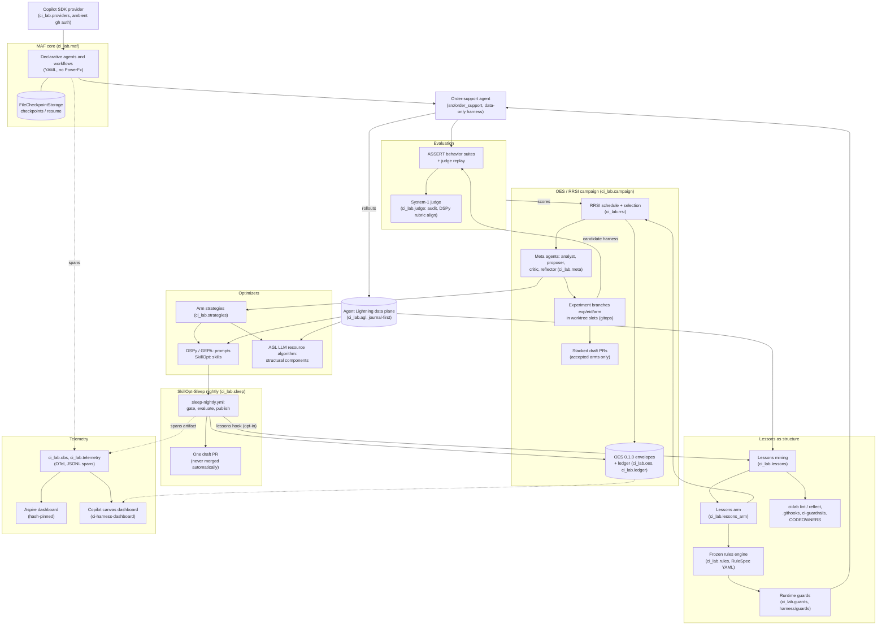

# The self-improving harness

The repo started as a set of ASSERT safety and quality evals for the order-support agent (see the
[README](../README.md)). On top of those evals sits `ci_lab`, a harness that improves itself. Every
agent and workflow runs on the Microsoft Agent Framework (MAF, Python, declarative YAML,
checkpointed), using models reached through the GitHub Copilot SDK with ambient auth.

Each change to the harness's editable prompts, skills, or structural components is an **experiment**:
- an OES envelope;
- an `exp/<eid>/<arm>` branch, built in its own worktree slot;
- scored by ASSERT evals plus the System-1 judge.

Experiments are driven either by an RRSI campaign, whose accepted arms become stacked draft PRs, or
by the nightly SkillOpt-Sleep GitHub Action, which opens one draft PR. Rollouts flow through the Agent
Lightning journal/store. DSPy/GEPA owns prompts, SkillOpt owns skills, and the LLM-only AGL
strategy owns structural components.

Lessons mined from traces and dev transcripts are encoded **as structure** rather than prose. They
become frozen rules and guards that the model cannot bypass, plus lint checks that fail CI. Every
step is traced to OpenTelemetry and shown on the Aspire dashboard and the Copilot canvas dashboard.

Nothing is adopted automatically. Every change lands as a draft PR that a human reviews and merges.

The binding design is [design/self-improving-harness.md](design/self-improving-harness.md). Where
sections conflict, §9 and §13.6–§13.7 override earlier ones.

## Architecture

## Agent bus, task graph and adversary

Three packages add an audited loop of student, voters and judge:

- [bus.md](bus.md): `ci_lab.bus`, a write-ahead, hash-chained log per topic. Voters score each
  proposal, a deterministic judge decides, and a successor agent sees only the corrected
  trajectory.
- [taskgraph.md](taskgraph.md): `ci_lab.taskgraph`, graphs of single deliverables with sealed,
  hidden rubrics, run in parallel by `ci-lab graph run`.
- [adversary.md](adversary.md): `ci_lab.adversary`, gamers and an LLM adversary that attack the
  rubric. Exploits feed rubric hardening and an evaluator-experiment proposal.

Campaign arm steps (`workflows/steps.py`) use the bus through `ci_lab.campaign.bus_adapter` when
`hyper.bus` is true (the default):

| Step | With the bus | With `hyper.bus: false` (legacy, kept for one release) |
|---|---|---|
| `critique_N` | `proposal.json` becomes a student proposal on topic `<eid>/<arm>`. The replayed critic, `critic-checks` and any `CampaignDeps.bus_voters` vote, and the judge appends a verdict. | `deps.critique` |
| `repair_N` | agent arms only: `succeed` starts a fresh proposer on the leak-screened student projection | `reinvoke_proposer` with a `sanitize_correction` text (also used for non-agent arms) |
| `evaluate` | the domain evaluation runs as an `evaluate` effect keyed by arm, split and head, so a rerun reuses the result | direct `deps.domain.evaluate` |
| `record` | the envelope gets `x-ci-bus: {run, topics, heads}` | no extension |

The bus lives in `<run_root>/bus`. Inspect it with `ci-lab bus verify <run_root>/bus`, `ci-lab bus
tail <run_root>/bus <eid>/<arm>` and `ci-lab bus heads <run_root>/bus <eid>`. After the arms run and
before `select`, the out-of-band challenger lane
(`hyper.challenger`, default `det`) attacks each arm's last proposal. It records exploits but never
changes selection or history; see [adversary.md](adversary.md#in-campaigns).

## Module docs

| Doc | Module | What it covers |
|---|---|---|
| [design/self-improving-harness.md](design/self-improving-harness.md) | — | Binding design: v2 constraints C1–C38, §11 optimizers, §12 telemetry, §13 lessons as structure (B1–B8, N1–N6) |
| [maf.md](maf.md) | `ci_lab.maf` | MAF core: declarative agents/workflows without PowerFx, tool registry, checkpoints |
| [providers.md](providers.md) | `ci_lab.providers` | `CopilotChatClient` on the Copilot SDK (ambient auth), client factory and profiles |
| [models.md](models.md) | `ci_lab.providers.models`, `campaign.preflight` | Every model id, its override (`CI_META_MODEL`, `CI_ASSERT_MODEL`, ...) and the copilot model preflight |
| [template.md](template.md) | `ci_lab.template` | Use this repo as a GitHub template: `ci-lab template init` / `doctor`, opt-in workflows, swapping in your own agent |
| [order-support-agent.md](order-support-agent.md) | `order_support` | The system under test: MAF declarative agent over the data-only harness |
| [judge.md](judge.md) | `ci_lab.judge` | System-1 judge provider, agreement audit, DSPy rubric alignment (proposal only) |
| [oes.md](oes.md) | `ci_lab.oes` | Open Experiment Standard 0.1.0 envelopes for every experiment |
| [rrsi.md](rrsi.md) | `ci_lab.rrsi` | RRSI Algorithms 1 and 2 with the v2 safeguards (pure) |
| [campaign.md](campaign.md) | `ci_lab.campaign` | RRSI campaigns as checkpointed MAF workflows, arms, stacked draft PRs |
| [meta-agents.md](meta-agents.md) | `ci_lab.meta` | Analyst, proposer, critic and reflector agents, plus the arm filesystem and commit tools |
| [strategies.md](strategies.md) | `ci_lab.strategies` | Arm strategies (`agent`, `gepa`, `skillopt`, `guard`, `agl`) |
| [optim.md](optim.md) | `ci_lab.optim` | DSPy LM, GEPA and SkillOpt over harness text (lazy imports) |
| [ledger-gitops-cache.md](ledger-gitops-cache.md) | `ci_lab.ledger`, `gitops`, `cache` | Durable experiment state, worktree slot pool, shared uv caches |
| [agl.md](agl.md) | `ci_lab.agl` | Agent Lightning 1.0.2 journal/store plus LLM-only structural optimizer |
| [sleep.md](sleep.md) | `ci_lab.sleep` | SkillOpt-Sleep nightly: gate, evaluate and publish a draft PR; opt-in lessons hook |
| [lessons.md](lessons.md) | `ci_lab.lessons` | Mining traces into lessons and routing them to enforcement rungs |
| [lessons-arm.md](lessons-arm.md) | `ci_lab.lessons_arm` | Lessons become guard rules through a paired guard-off/on experiment arm |
| [rules.md](rules.md) | `ci_lab.rules` | Frozen, pure rules engine over `RuleSpec` YAML |
| [guards.md](guards.md) | `ci_lab.guards` | Runtime trajectory correction inside MAF (block, redact, remediate) |
| [lint.md](lint.md) | `ci_lab.lint` | `ci-lab lint`/`reflect`, git hooks, `lint.yml`, the ci-guardrails extension, CODEOWNERS |
| [telemetry.md](telemetry.md) | `ci_lab.telemetry` | TracerProvider ownership, JSONL spans, hash-pinned Aspire dashboard, `telemetry pull` |
| [canvas.md](canvas.md) | `ci-harness-dashboard` | The Copilot app canvas showing campaigns, evals, nights, rollouts and traces |
| [chat.md](chat.md) | `ci_lab.chat` | `ci-lab chat serve`: the experiment-designer AG-UI agent that drafts and (with approval) launches campaigns |
| [bus.md](bus.md) | `ci_lab.bus` | Write-ahead agent bus: hash-chained topics, invariants, voters, judge, projection and succession, `ci-lab bus` |
| [taskgraph.md](taskgraph.md) | `ci_lab.taskgraph` | Task graphs: parallel single deliverables, sealed hidden rubrics, student firewall, `ci-lab graph` |
| [adversary.md](adversary.md) | `ci_lab.adversary` | Gamers and LLM adversary, exploit duels, gated rubric hardening, campaign challenger lane |
| [governance.md](governance.md) | `ci_lab.governance` | AGT/ACS policies on every MAF agent, campaign launch gate, SRE arm vetoes, hash-chained audit, `ci-lab governance` |

## Trust boundaries

- **MAF all the way down, fail-closed.** Meta agents are MAF harness agents built from declarative
  specs. A spec can declare read-only **subagents** (`x-ci.subagents`). Each one runs as a MAF
  background agent (`create_harness_agent(background_agents=...)`) on the parent's chat client, so it
  uses the same Copilot SDK provider. The proposer uses this to hand failure drill-downs to
  `failure_analyst` ([meta-agents.md](meta-agents.md#subagents)). Sleep nights run on the MAF
  declarative `WorkflowFactory` with `FileCheckpointStorage`. If MAF can't be imported, the
  `copilot` and `offline` profiles raise an error rather than falling back to the sequential
  interpreter, which runs only when requested ([sleep.md](sleep.md)).
- **Draft PRs only.** Campaigns, sleep nights, judge alignment, `ci-lab reflect` and the lessons hook
  only propose changes. Merging is always a human decision.
- **Governed agents.** Every MAF agent is built through the governed factory and checked against
  ACS policies; campaign launches pass a kill-switch, error-budget and protected-scope gate, and a
  real publish needs an identity-bound approval ([governance.md](governance.md)). This is
  application-layer policy, not an OS sandbox.
- **Frozen paths.** These are listed in `.github/extensions/ci-guardrails/policy.mjs`:
  - contracts;
  - `RuleSpec` and the rules engine;
  - `lint/rules/**`;
  - `**/harness/guards/**`;
  - the safety oracle.

  The ci-guardrails extension denies agent edits to them in the dev loop. `.github/CODEOWNERS`
  requires owner review for them, and for the judge, the workflows and the extensions
  ([lint.md](lint.md#codeowners)).
- **Unlocked dependency sync.** `uv.lock` is intentionally not committed, because it is generated
  against an internal package proxy. CI resolves from the version bounds in `pyproject.toml`. So the workflows run
  `uv sync` rather than `uv sync --frozen`. Each workflow says so in a comment
  ([sleep.md](sleep.md), [lint.md](lint.md)).
- **Spans artifact.** `sleep-nightly.yml` uploads its redacted spans as the `spans` artifact. This
  is the default name `ci-lab telemetry pull` expects ([telemetry.md](telemetry.md)).

## Known limitations

- **PII redaction is not subject-scoped.** Verifying *any* order in a conversation disables
  redaction for the rest of it, including other customers' data.
- **Response blocks are not expressible.** A `*` tool pattern can't block, and responses have no
  tool target. A rule can therefore remediate or redact a response, but it cannot block one.
- **Redaction only changes the returned text.** The conversation history still holds the PII.
- **Rule conflict detection is conservative.** `ci_lab.rules` only reports conflicts it can show
  syntactically, for rules on the same `on`/`target`:
  - identical predicates with a different action or mode;
  - directly contradictory `require` facts under the same (or no) `when`.

  Semantic overlaps, such as different `when` predicates that match the same steps, are not detected.
- **The campaign must enforce lessons-arm N5.** Prose deletions in the lessons arm are proposals.
  `ci_lab.lessons_arm` does not enforce N5 on its own.
- **The Aspire login URL format is assumed.** `ci-lab dashboard url --with-token` and `open` build
  `<ui_url>/login?t=<browser token>` themselves. A newer Aspire release that changes its login route
  would break auto-login. Only 13.6.1 is pinned: win-arm64, win-x64, linux-x64 and osx-arm64 have sha256 pins.
  Other platforms need `--trust-new` on first use.
- **`reflect` drops many events.** Its detectors only read the transcript events they recognize.
  Everything else in a Copilot session is ignored.
- **The `Domain.evaluate` case filter is deferred.** Evaluation always runs the full case set for a
  domain.
- **AGL is deliberately not an RL trainer.** This implementation uses Agent Lightning 1.0.2 only
  for its journal/store/proxy substrate and an LLM-only structural algorithm. It never imports
  `verl`, needs no GPU, never optimizes prompts (DSPy/GEPA), and never optimizes skills (SkillOpt).
- **Subagent state is in memory.** MAF background-agent tasks live in the parent's session and do
  not survive a process restart ([meta-agents.md](meta-agents.md#subagents)).
- **Sleep nights don't resume.** The nightly job always starts a night fresh
  ([sleep.md](sleep.md#known-limitations)).
- **The Copilot SDK has no temperature or seed control.** Copilot-backed agents can't be made deterministic
  through sampling settings. Determinism comes from fixtures, the replay journal and paired
  evaluation.
- **MAF declarative agents are experimental** upstream. Their YAML schema and loader may change
  between MAF releases. `pyproject.toml` bounds them to `agent-framework-declarative>=1.1,<2`.
